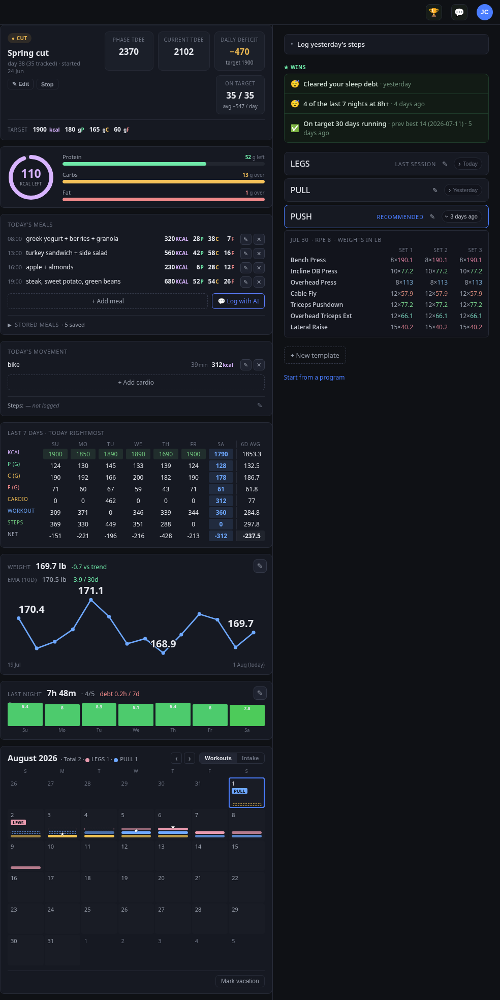
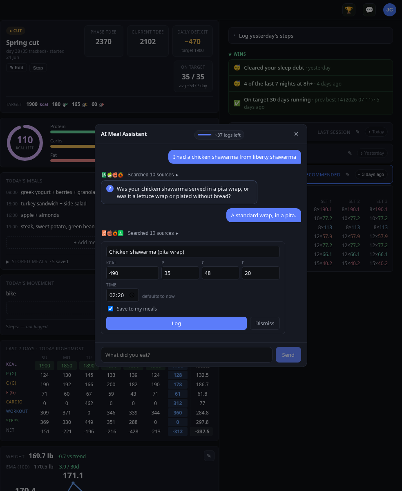
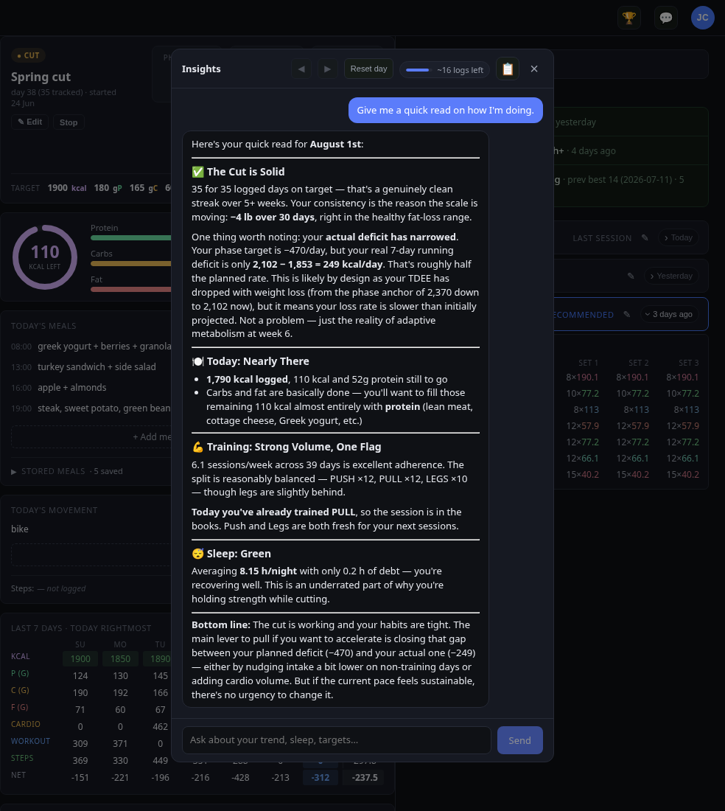
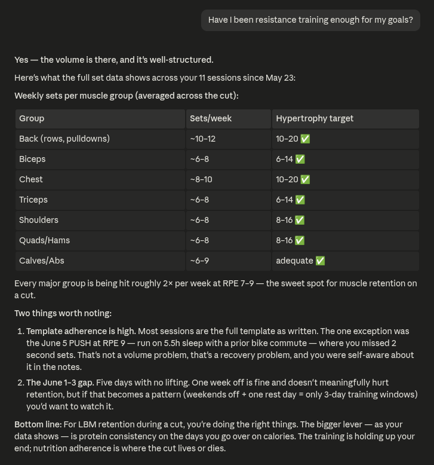
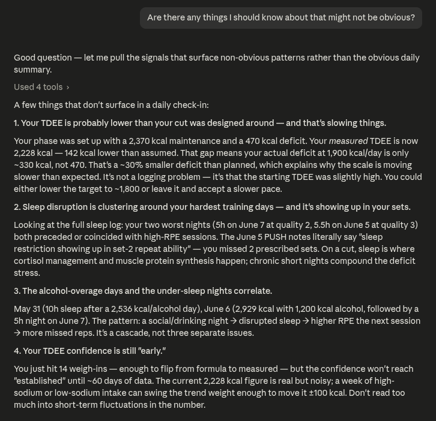
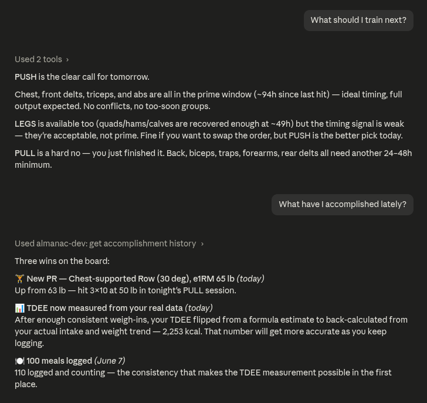
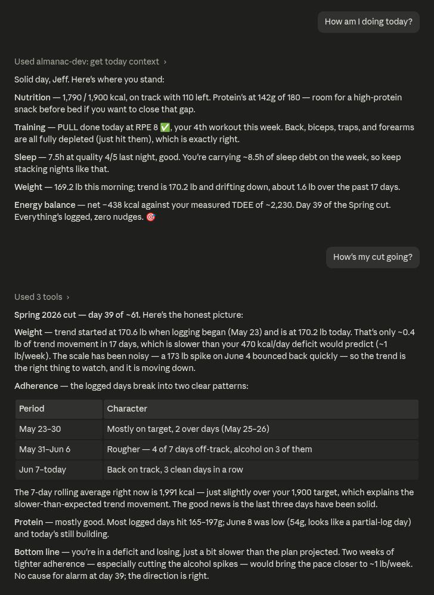

# Almanac

[](https://github.com/corcoran/almanac/actions/workflows/ci.yml)
[](https://github.com/corcoran/almanac/tags)
[](LICENSE)
[](https://almanac-fitness.com/guide/)


**A precise, self-hosted fitness record your own AI agent can read.**

**[See what it does →](https://almanac-fitness.com/)** &nbsp;·&nbsp; **[Read the docs →](https://almanac-fitness.com/guide/)**

Almanac keeps an accurate account of what you eat, lift, weigh, and sleep, then hands it to the assistant you already use over MCP. Ask how your cut is going or what to train today, and the answer comes from your own numbers, not a guess. It runs on your hardware, so the record stays yours.

No outside assistant needed: the web dashboard does everything, and two chat surfaces are built in — an AI meal assistant that turns "chicken burrito bowl" into editable macros, and a read-only insights coach. One API, one SQLite file, so every surface sees the same data.

## Screenshots

The web dashboard. Nutrition phase and TDEE, today's macros and meals, a
seven-day macro grid, weight trend, sleep, and the training panel with a
recommended session.

<p align="center">
  
</p>

The built-in AI meal assistant. Describe what you ate and it returns editable
entries, looking up unfamiliar foods and asking about portion size when it
changes the math.

<p align="center">
  
</p>

The AI insights coach. A read-only read of your logged history: nutrition
adherence, TDEE drift, training volume, and sleep.

<p align="center">
  
</p>

Logging and reviewing through an outside assistant over MCP:

| | |
|---|---|
|  |  |
|  |  |

## Architecture

```
Browser ──► nginx ──► oauth2-proxy ──► almanac-web   (Vue 3 SPA)
                          │
                          ├──► almanac-api   (Fastify + SQLite)
                          │
Claude / ChatGPT ─────────┴──► almanac-mcp   (70+ tools, 5 resources)
                                    │
                                    └──► almanac-api
```

Four containers behind nginx. oauth2-proxy handles browser SSO (Google, GitHub, or any OIDC provider it supports); MCP traffic bypasses SSO and authenticates via OAuth 2.1 or personal access tokens (PATs). All auth paths converge on the same PAT format stored in SQLite.

See the [authentication guide](https://almanac-fitness.com/guide/authentication) for the full architecture.

## Documentation

Full documentation is at **[almanac-fitness.com](https://almanac-fitness.com/)**.

- [Getting started](https://almanac-fitness.com/guide/getting-started) — install and run locally
- [Deploy](https://almanac-fitness.com/guide/deploy) — production walkthrough
- [Authentication](https://almanac-fitness.com/guide/authentication) — Google, GitHub, or any OIDC provider, step by step
- [Connecting assistants](https://almanac-fitness.com/guide/connecting-assistants) — MCP clients and PATs
- [Configuration](https://almanac-fitness.com/guide/configuration) — every environment variable
- [Operations](https://almanac-fitness.com/guide/operations) — updates, backups, recovery
- [Architecture](https://almanac-fitness.com/guide/architecture) — how the MCP layer works

## Features

### Nutrition

- **Meal logging** — log meals with kcal, protein, carbs, and fats. Edit, delete, and review meals by date.
- **Stored meals** — save a meal definition once (name + macros) and log it as eaten in one tap.
- **Nutrition phases** — cut, bulk, or maintenance phases with daily kcal targets (static or TDEE-relative) and macro splits. The create form suggests a split from your bodyweight and target; a guided cold-start collects what a TDEE estimate needs.
- **Macro analytics** — today's totals vs. target, historical summaries by date or range, rolling 7-day averages, and on-track / at-risk / off-track verdicts.
- **TDEE estimation** — three-tier basis: profile baseline (Mifflin BMR × activity), measured intake (back-calculated from weight trend), or user assertion. Calibrates from baseline to measured over ~14 days of weigh-ins.

### Body composition

- **Weight logging** — daily weigh-ins with optional notes.
- **Weight trend** — exponential-weighted moving average with 14-day and 30-day views, change rate, and confidence levels.

### Training

- **Workout templates** — build reusable templates with ordered exercises and defaults, directly in the app or via an assistant. Start a session from a template, then skip, override, or add exercises as you go. Starter programs (Push/Pull/Legs, Upper/Lower) seed a whole split for new users.
- **Set tracking** — log reps, weight, and RPE (1–10) per set. Duration and estimated kcal per workout.
- **Exercise library** — custom exercises organized into muscle groups. Archive exercises you no longer use.
- **Stim state / recovery** — per-muscle-group recovery tracking (0–100) with phase classification (too_soon → prime → detrained). Multi-phase decay model with hours-since-last and trainable-capacity signals.
- **Workout recommendations** — template recommendation engine scores which workout to do next based on current recovery state across all muscle groups.

### Cardio, steps, and alcohol

- **Cardio** — log sessions by modality (bike, run, ruck, etc.) with duration, distance, average HR, and estimated kcal (Keytel / METs formulas).
- **Steps** — daily step count with automatic kcal estimation. Override estimates when you have better data.
- **Alcohol** — session-based logging (start/end, drink count in US standard drinks, kcal estimate). Overlays onto daily energy balance.

### Sleep

- **Sleep logging** — hours and quality (1–5) per night, with timezone-aware midnight crossing.
- **Sleep debt** — rolling debt calculation over a configurable window (default 14 days) against a baseline.

### Accomplishments

- **Wins** — milestones derived automatically from your logs: logging and workout streaks, calorie-adherence streaks, body-weight milestones off the smoothed trend, strength PRs, sleep recovery, and the moment your TDEE flips to measured. Each shows its previous best and earns the moment a log completes it. Lifetime milestones (100th workout, total kilograms lifted, meals and weigh-ins logged) are backdated to the day you crossed them.

### Web UI

- **Daily dashboard** — a calorie ring and draining protein/carb/fat bars, current vs. phase TDEE, deficit/surplus and on-target adherence, today's meals and movement, weekly macro grid, weight sparkline, sleep debt, phase progress, and an earned-wins section above the workout picker.
- **Editable cards** — meals, weight, sleep, cardio, and steps are all add/edit/delete directly in the dashboard, not just in chat. Edits update the ring, bars, week grid, and trends right away.
- **Phase controls** — start, edit, and stop a nutrition phase from the dashboard, with a live TDEE estimate and macro suggestions in the create form.
- **Workout panel** — template picker, build/edit templates and starter programs, active session with live set entry, add-exercise-mid-session, end/save dialog, and last-session reference.
- **Calendar** — month view in Workouts or Intake mode. Workouts mode shows per-template tallies, recovery pills (too_soon, prime, etc.), and a forward recommendation window; Intake mode tints each day by adherence. Tap a day (or step with `‹ ›`) to view and edit any past day; the URL reflects the day (`?date=…`).
- **Copy stats for LLM** — one button copies a full markdown briefing of your current picture (phase, TDEE, today, trends, recent workouts, a 14-day history table) to paste into any chat.
- **AI Meal Assistant** — an in-app chat panel where you describe what you ate and get editable proposal cards to log. It matches your stored-meal library first, estimates otherwise, and can web-search unfamiliar foods. A daily token budget shows "~N logs left"; both budget and search have configurable caps. Optional — see [Configuration](#configuration).
- **AI insights coach** — a second panel that reads your logged history back to you: nutrition adherence, TDEE drift, training volume and split balance, and sleep. Read-only by design (no write tools, no web search). Transcripts persist per day with `◀ ▶` navigation, and opening a fresh day auto-asks for a quick read. Runs a stronger model than the meal parser (`ALMANAC_LLM_INSIGHTS_MODEL`).
- **Settings** — profile editing, activity level, timezone and unit (metric/imperial) selectors, PAT creation/revocation, and the MCP URL for connecting an assistant.
- **Mobile responsive** — single 768 px breakpoint, swipeable panels via CSS scroll-snap, contextual sticky header, and 36 px touch targets.

### MCP integration

- **70+ tools, 5 resources** — full CRUD for every entity (including stored meals and `log_meal_from_stored`), plus derived signals (stim state, TDEE, sleep debt, day status, calendar), `get_next_best_action` for onboarding/next-step guidance, and `get_accomplishments` so an assistant can surface your earned wins in chat.
- **Works with Claude (mobile, Desktop, Code) and ChatGPT** — say "two eggs, toast and butter, and a flat white" and the assistant works out the calories and macros, then logs it; it shows up in the web UI. Note that adding a custom MCP server is a paid-plan feature on both, so check the current terms before counting on it for everyone you invite; the web dashboard and its built-in AI surfaces work on any account.
- **OAuth 2.1** — Claude mobile and ChatGPT connect through the standard MCP OAuth flow, using whichever SSO provider you configured. No manual token setup.
- **PAT auth** — personal access tokens for Claude Code or any HTTP client.
- **Idempotent logging** — safe to retry meal, weight, and sleep log calls.

### Auth

- **One user or several** — the allowlist decides. Each allowlisted email gets its own account, provisioned automatically on first sign-in; there's no separate account-creation step. The first account on a fresh instance is bootstrapped as admin, so you're never locked out of the admin tooling — make sure that first sign-in is *you* (see the [authentication guide](https://almanac-fitness.com/guide/authentication) for the cached-session gotcha and how to reassign it).
- **Three-layer allowlist** — oauth2-proxy (browser SSO), API (account provisioning), and MCP (OAuth flow) all enforce the same `allowed-users.txt` file.
- **OAuth tokens are real PATs** — minted via the API, stored in SQLite, visible and revocable in the web Settings panel.
- **Per-user data isolation** — every record is scoped to its owner. Reads and writes are enforced against the authenticated user at the data layer, so one account never sees or touches another's data.

## Requirements

- Node 20 or newer
- pnpm 9 or newer
- Docker (for production; optional for local dev)

SQLite ships bundled via `better-sqlite3`.

## Quickstart — local dev

The local dev script starts all services (API, web, MCP, oauth2-proxy) in one command:

### 1. Install

```bash
pnpm install
```

### 2. Configure `.env`

```bash
cp .env.example .env
```

Edit `.env` and set your OAuth credentials and dev email. See `.env.example` for documentation on each variable. The stack defaults to Google, but any provider works — GitHub needs nothing but a client ID and secret, and any OpenID Connect issuer (Keycloak, Authentik, Zitadel) works by setting an issuer URL. See [Authentication](https://almanac-fitness.com/guide/authentication) for the walkthrough.

### 3. Start everything

```bash
scripts/local-dev/up.sh
```

This starts:
- **almanac-api** on `:3001` (Fastify, trusts proxy headers)
- **almanac-web** on `:5173` (Vite dev server)
- **almanac-mcp** on `:3030` (Streamable HTTP + OAuth 2.1)
- **oauth2-proxy** on `:4180` (Docker container, SSO)

Stop everything with `scripts/local-dev/down.sh`.

#### Without Docker (no OAuth)

If you don't need the real OAuth sign-in path, skip `.env`, docker, and
oauth2-proxy entirely:

```bash
scripts/local-dev/dev-noauth.sh you@example.com          # web on 127.0.0.1
scripts/local-dev/dev-noauth.sh you@example.com --lan    # web on 0.0.0.0 (other devices)
```

This runs the API + web with **header-trust auth**: the Vite dev proxy injects
the `x-forwarded-email` header that oauth2-proxy would emit in prod, so the UI
needs no login and acts as the email you pass. Migrations run automatically on
API boot. Ctrl-C stops both.

> **`--lan` caveat:** binding the web server to `0.0.0.0` means anyone on your
> network is authenticated as that email. Use it only on a trusted network.

For **MCP** in this mode, run it in stdio transport against the local API (mint a
PAT in the web Settings panel first) — the script prints the exact command on
startup.

#### Demo instance (populated with fake data)

To see the UI fully populated — every panel non-empty, both AI surfaces unlocked —
without touching your real data:

```bash
scripts/local-dev/demo.sh              # 127.0.0.1
scripts/local-dev/demo.sh --lan        # LAN, for phone testing
scripts/local-dev/demo.sh --days 90    # longer history
```

This seeds a throwaway SQLite file and runs the API + web on `:3099`/`:5199`, so
it can run alongside your normal dev stack. The data is anchored relative to
today (an active cut phase, 40 days of meals, weigh-ins, sleep, steps, a PPL
split with session history), so it never goes stale. It sources `.env` for
`ANTHROPIC_API_KEY` — without one the UI still renders but the AI panels report
`llm_available: false`. Ctrl-C stops it; `rm -f /tmp/almanac-demo.sqlite*` to
delete the data.

#### Screenshots

`scripts/local-dev/screenshot.mjs` captures the running UI headlessly, driving
your system Chrome via `playwright-core` (no bundled browser download). Capture
height is independent of your display, so a full-page dashboard shot works on
any screen:

```bash
node scripts/local-dev/screenshot.mjs                        # full dashboard
node scripts/local-dev/screenshot.mjs --preset both          # desktop + mobile
node scripts/local-dev/screenshot.mjs --scene meal-lookup    # AI modal (real LLM call)
```

Defaults to 984 px wide at 1×, matching the screenshots above. `--scene` clicks a
modal open before capturing; `--help` lists the available scenes.

### 4. Connect Claude Code to MCP

Register the MCP server by URL:

```json
{
  "mcpServers": {
    "almanac": {
      "type": "url",
      "url": "https://almanac.example.com/mcp",
      "headers": {
        "Authorization": "Bearer alm_XXXXX"
      }
    }
  }
}
```

For local dev with a PAT, point at `http://localhost:4180/mcp`. For OAuth-capable clients (Claude mobile, ChatGPT), just use the public URL — the OAuth flow handles everything automatically.

> **A local URL only works for local clients.** Claude Code (and anything else
> running on the same machine) can reach `localhost` or a LAN address. Claude's
> and ChatGPT's web and mobile apps cannot: they connect from the vendor's
> servers, so `localhost` is *their* localhost and a `192.168.x` address isn't
> routable from outside your network. Those clients need Almanac published at a
> public HTTPS domain — see the [deploy guide](https://almanac-fitness.com/guide/deploy).
> The app detects this and adjusts the connect instructions it shows you.

> **Connecting a custom MCP server is a paid feature on both Claude and
> ChatGPT.** Adding your own remote MCP server is gated behind their paid
> plans, and which plans qualify has changed more than once — check the current
> terms before assuming someone can connect. This bites hardest when adding
> other people: a free-plan account cannot add Almanac as an MCP server no
> matter how the server is deployed. They can still use Almanac fully through
> the web dashboard, including the built-in AI meal assistant and insights
> coach, which run on the server's own API key and need nothing from the user.

### 5. Verify

Open Claude Code. The `almanac` tools should show up under the `almanac` server. Tell Claude what you ate in plain language — "two eggs, toast and butter, and a flat white" — and it should estimate the calories and macros itself, log them, and show you what it recorded. The meal then appears in the web UI and via `get_macros_today`.

## Configuration

Almanac is configured entirely through `.env`. `.env.example` documents every
variable inline, and the [configuration reference](https://almanac-fitness.com/guide/configuration)
covers all of them grouped by concern — core, MCP, OAuth, watchtower
notifications, and the optional LLM surfaces.

The AI surfaces are off by default and run on your own Anthropic API key, so
they cost real money per use. Per-user daily token and search caps are
available; left unset there is **no cap**. See the
[LLM section](https://almanac-fitness.com/guide/configuration#llm-ai-surfaces)
before you turn them on or invite other people.

## Production deployment

Almanac runs as four Docker Compose services (web, API, MCP, oauth2-proxy)
behind host nginx with TLS. Only oauth2-proxy binds a host port; the three
almanac services stay internal to the Docker network. Images build in CI and
publish to GHCR on each release tag, so the server pulls prebuilt images and
never builds locally, with an optional watchtower service for hands-off updates.

The email allowlist is enforced at three independent layers, all reading the
same `allowed-users.txt`: oauth2-proxy for browser traffic, the API for account
provisioning, and the MCP server during the OAuth flow.

- **[Deploy](https://almanac-fitness.com/guide/deploy)** — DNS, TLS, nginx, OAuth, first boot
- **[Operations](https://almanac-fitness.com/guide/operations)** — updates, watchtower, backups, recovery

## Testing

```bash
pnpm -r test        # full test suite across all packages
pnpm -r typecheck   # tsc --noEmit workspace-wide
pnpm lint           # Biome
pnpm format         # Biome
```

Per-package: `pnpm --filter @almanac/<pkg> test`.

## Troubleshooting

- **API returns 403 for a new user.** The email is not in `allowed-users.txt`. Add it and restart the API container (or wait for oauth2-proxy to hot-reload the file).
- **`ALMANAC_DB_PATH` ended up in the wrong place.** Classic `pnpm --filter` cwd trap — relative path resolved against `packages/<pkg>/`, not the workspace root. Use an absolute path.

## Project layout

```
almanac/
├── packages/
│   ├── core/           # SQLite, migrations, repos, domain types, signals, schemas
│   ├── api/            # Fastify HTTP server, zod request/response validation
│   ├── mcp/            # MCP server, MCP tools + resources, OAuth 2.1
│   └── web/            # Vue 3 SPA, Vite, Pinia
├── deploy/             # nginx config, post-migration smoke test
├── docs/               # documentation site (VitePress) + landing page
├── scripts/
│   └── local-dev/      # up.sh / down.sh, dev-noauth.sh, demo.sh, screenshot.mjs
├── docker-compose.yml
├── allowed-users.txt   # shared email allowlist
├── .env.example
└── pnpm-workspace.yaml
```

## License

[BSD 2-Clause](LICENSE)
